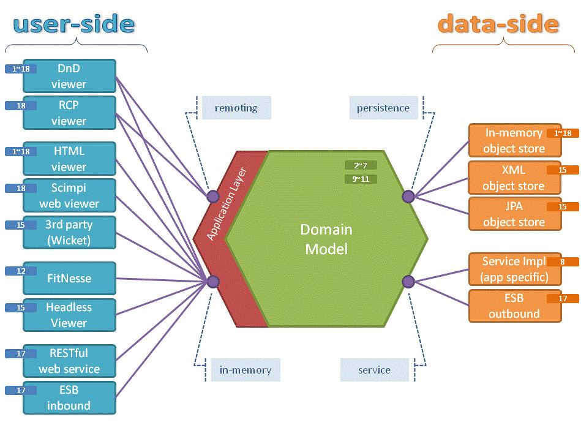
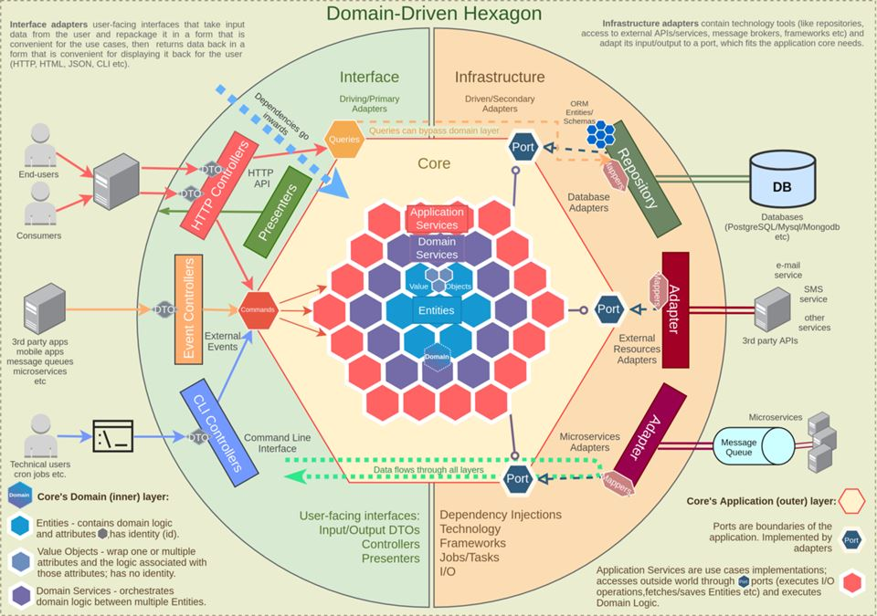
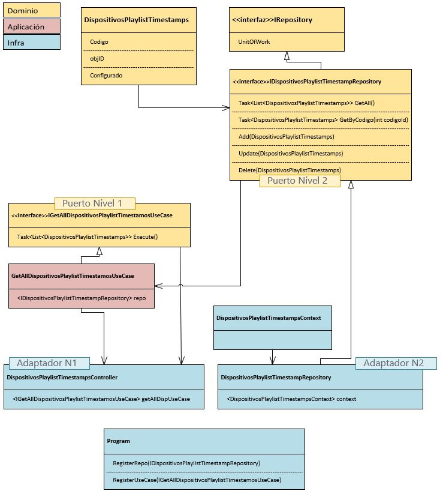

# Descrición de Arquitectura Hexagonal

La Arquitectura Hexagonal, tambien conocida como Ports&Adapters, es una arquitectura de software enmarcada dentro de las conocidas como **Clean Arquitectures**. La implementación de una arquitectura de este tipo se basa en la necesidad de realizar las implementaciones necesarias para que la lógica de negocio se pueda comunicar con elementos externos sin necesidad de cambios. 

## Objetivo

El objetivo final de la Arquitectura Hexagonal es dotar a la aplicación en la que se implementa de muchas ventajas, tales como:
* Mejor adaptabilidad, ya que no la hace dependiente de ningún elemento de infraestructura concreto.
* Test más fácil de implementar.
* Abstrae al core de la aplicación de los detalles de implementación.
* El mantenimiento de la aplicación es mucho más sencillo.

En el siguiente grafico, vemos con mayor nivel de detalle la separación de conceptos que propone la implementación de arquitectura hexagonal:

La arquitectura hexagonal utiliza la metáfora de los puertos y adaptadores para representar las interacciones entre el interior y el exterior. Para ello, utiliza la siguiente clasificación:
* Puertos de Nivel 1: Se definen en la capa de Dominio. Son interfaces que se crean para exponer los Casos de Uso implementados en la capa de Dominio.
* Puertos de Nivel 2: Se definen en la capa de Dominio. Son interfaces que deben implementar los adaptadores de Nivel 2 para asegurar la correcta comunicación con sistemas externos (BBDD, Mensajeria, Sistema de Ficheros, etc.).
* Adaptadores de Nivel 1: Son las implementaciones de las interfaces de los Puertos de Nivel 1. Se utilizan para la implementación de las comunicaciones con el usuario final, por ejemplo, un controlador de una WebAPI.
* Adaptadores de Nivel 2: Son las implementaciones de las interfaces de los Puertos de Nivel 2. Se utilizan para que el Dominio de la aplicación pueda hacer uso de los sistemas de Infraestructura.

## Implementación de Ejemplo

En el ejemplo de código de este repositorio se ha implementado esta arquitectura de una forma muy básica para que sirva como concepto.

